# Artboards

This is an autogenerated file showing all the artboards. Do not edit it directly.

## 1.0

## 1.1

## 1.2

## 1.3

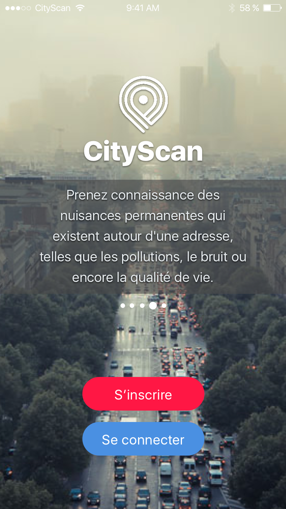

## 1.4

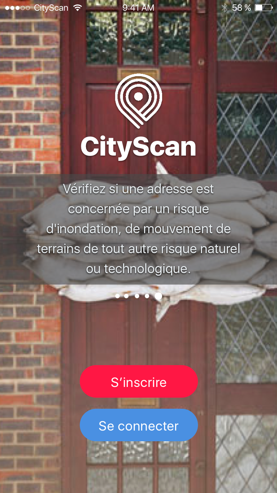

## 10.1 About

## 10.2 About description open

## 10.3 About description open link color

## 2.0 Login

## 2.1 Sign up

## 3.0 Profile & quick menu

## 4.0 Search address GPS enabled

## 4.1 Search address with popover

## 5.0 Adress score summary B FREE

## 5.1 Adress score summary C FREE

## 5.2 Adress score summary D FREE

## 5.3 Adress score summary PRO

## 6.0 Immobilier Category Summary

## 6.1 Transport Category Summary

## 6.1.0 Transport Category

## 6.10 Immobilier Category Summary FREE

## 6.11 Purchase prompt

## 6.2 Education Category Summary

## 6.3 Commodités Category Summary

## 6.4 Nuisances Category Summary

## 6.5 Risques Category Summary

## 6.6 Numérique Category Summary

## 6.7 Emploi Category Summary

## 6.8 Urbanisme Category Summary

## 6.9 Voisinage Category Summary

## 7.0 Comparing adresses PRO & FREE

## 7.0 Comparing adresses PRO

## 8.0 Selecting addresses to compare

## 9.0 Purchasing options

## 9.1 Purchasing options

## 9.2 Purchasing options

## Alert

## Cell Elements

## CityScan icon round red on white

## Elements

## Keyboard

## Keyboard

## Maps

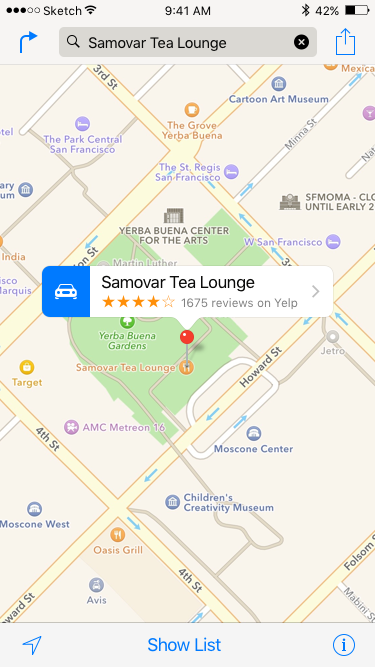

## Mask

## Navigation Bar

## Preview 1.0 Home

## Preview 10.0 About

## Preview 2.0 Login

## Preview 3.0 Profile & quick menu

## Preview 4.1 Search address with popover

## Preview 5.0 Adress score summary

## Preview 6.2 Address score detailed

## Preview 7.0 Comparing adresses

## Preview 8.0 Selecting addresses to compare

## Preview 9.0 Purchasing options

## Scores comparison

## Status Bar black

## Status Bar

## Tab bar

## a-grade-lg-round

## a-grade-sm-rounded-corners

## a-grade-small-plain

## a-score-img

## address-checklist

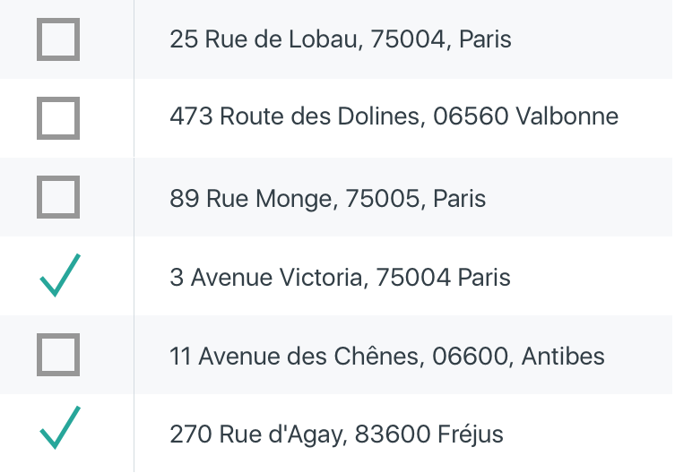

## apple-map-pin-icon

## apple-map-searched

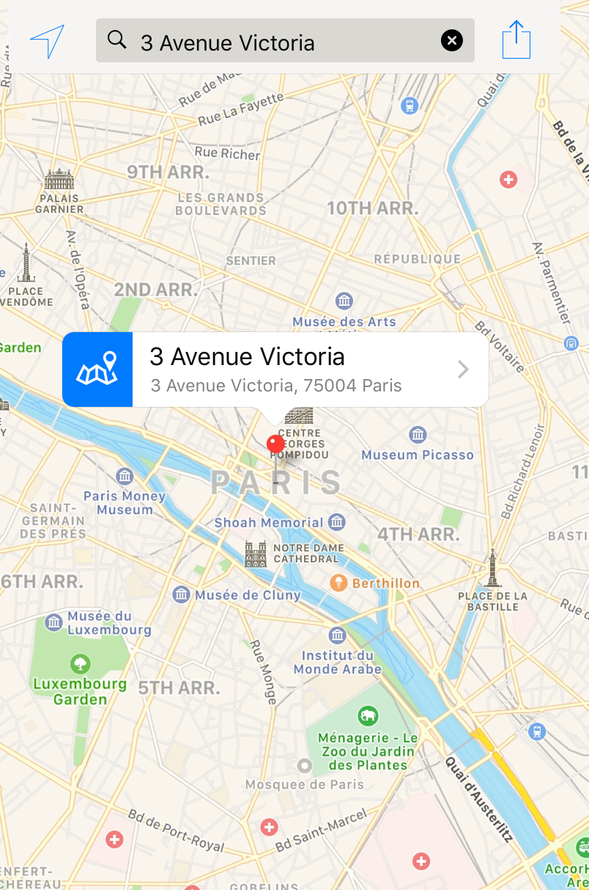

## apple-map-searching

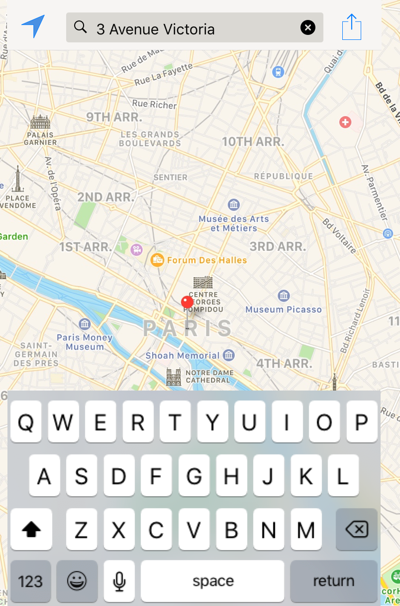

## b-grade-lg-round

## b-grade-sm-rounded-corners

## b-grade-small-plain

## b-score-img

## basket-icon

## burger-menu-white

## bus-pin-icon

## c-grade-lg-round

## c-grade-sm-rounded-corners

## c-grade-small-plain

## c-score-img

## car-icon

## checkbox-icon

## cityscan-icon-small-red

## comments-icon

## commoditiés-detailled-table

## compare-icon

## d-grade-lg-round

## d-grade-sm-rounded-corners

## d-grade-small-plain

## d-score-img

## download-icon-red

## download-icon

## education-table

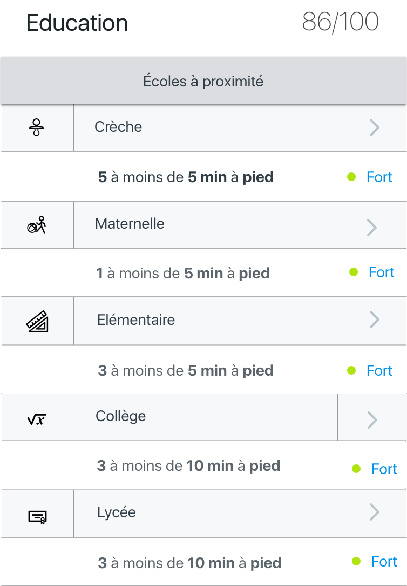

## emploi-table

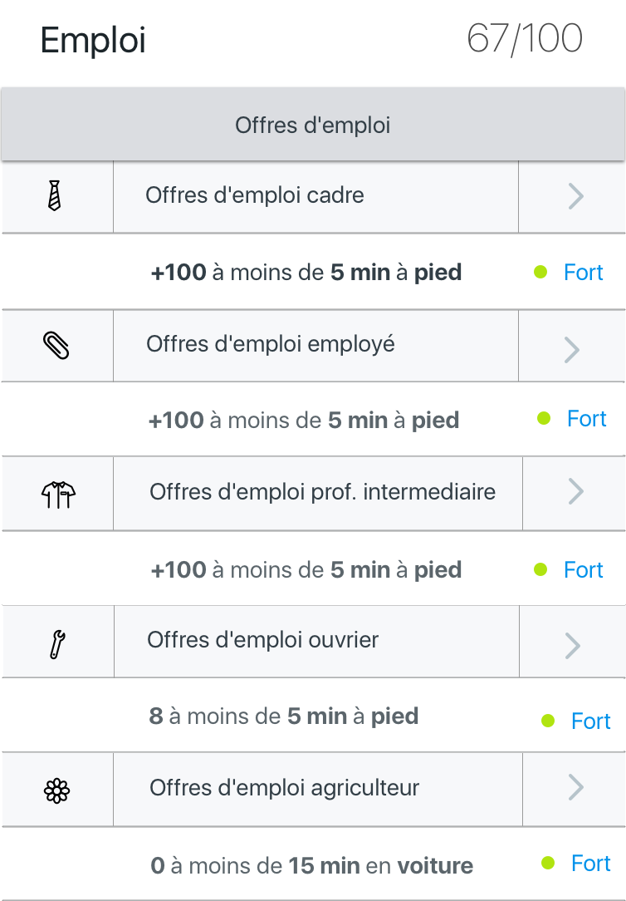

## green-checkmark

## green-square-rounded-icon

## grey-square-rounded-icon

## grey-square-rounded-q-icon

## heart-icon-white

## immobilier-compare-table

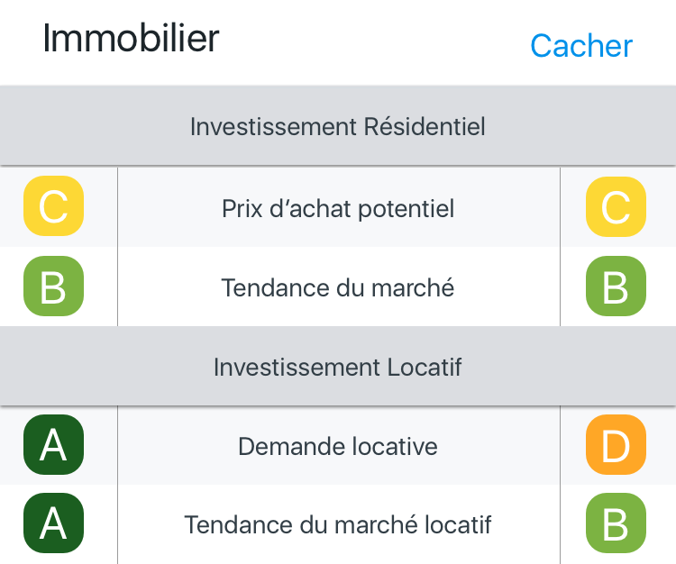

## left-arrow-white

## log-in-btn

## map-icon

## maps-icons-all

## missing-grade-sm-rounded-corners

## nuisances-detailled-table

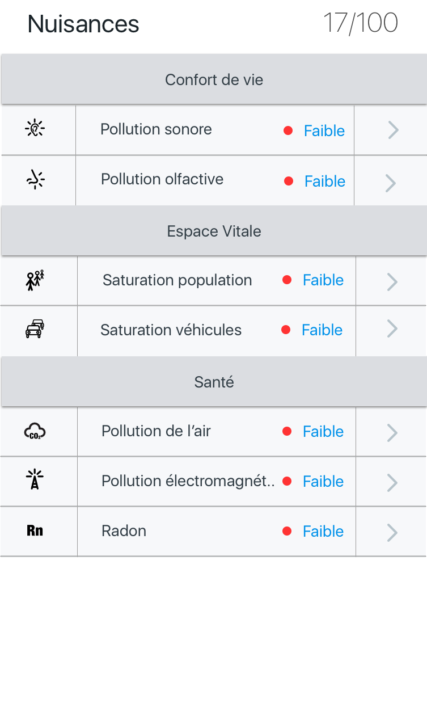

## numerique-table

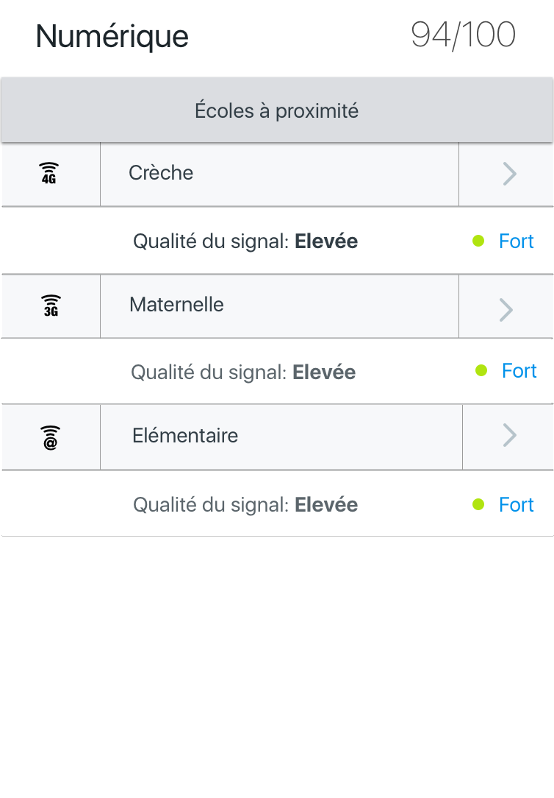

## offers-icon

## point-faible-category

## point-faible-txt

## point-fort-category

## point-fort-txt

## point-moyen-category

## prompt-buy-address

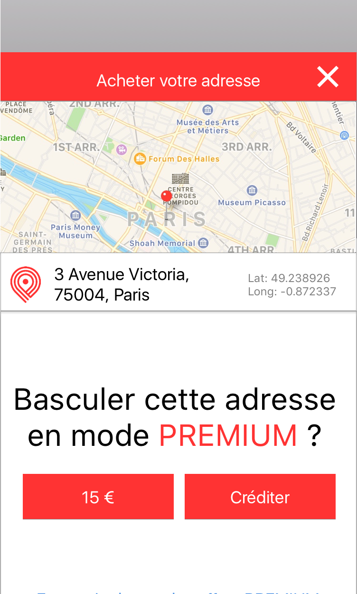

## quickmenu

## red-square-rounded-icon

## risques-detailled-table

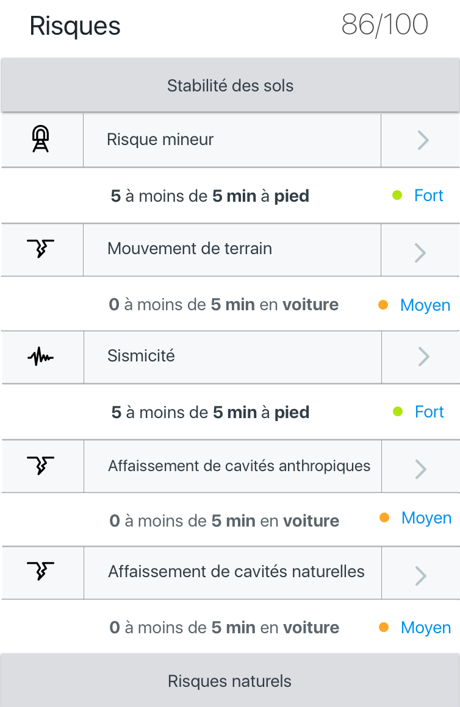

## score-btn-bad

## score-btn-good

## sign-up-btn

## transport-compare-table

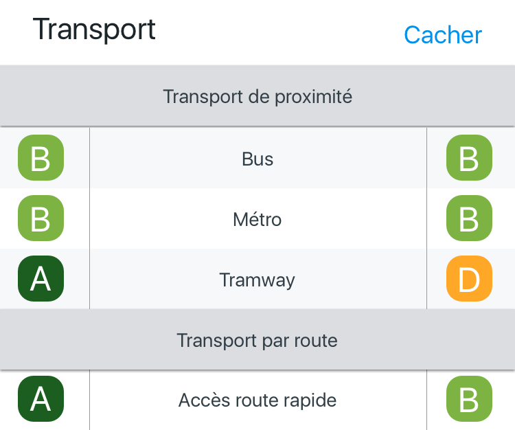

## transport-detailled-table

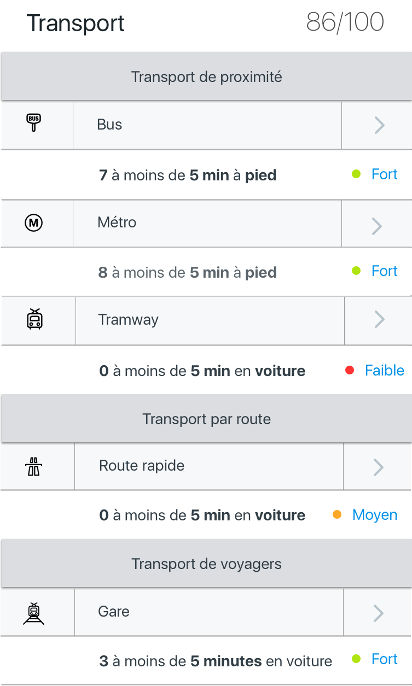

## transport-detailled

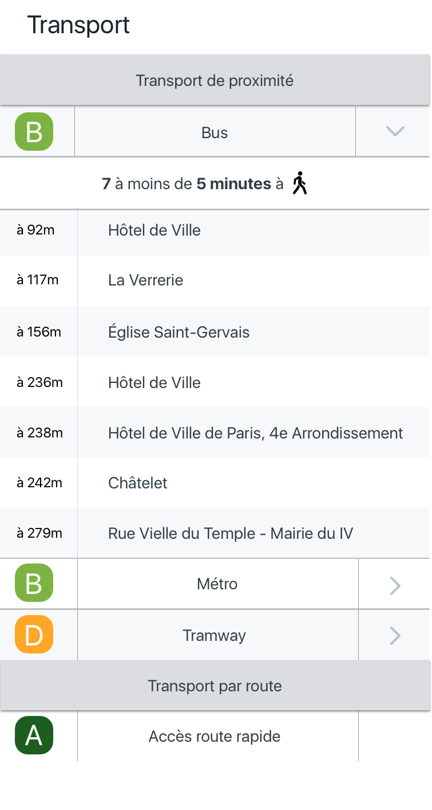

## urbanisme-detailled

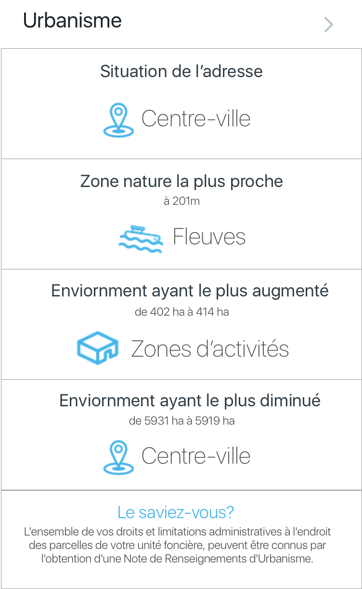

## walking-icon

